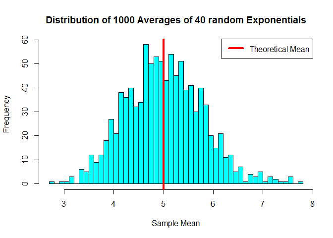
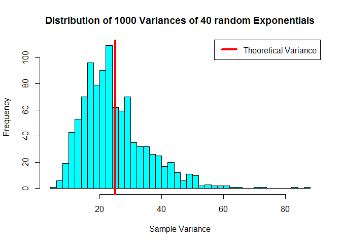
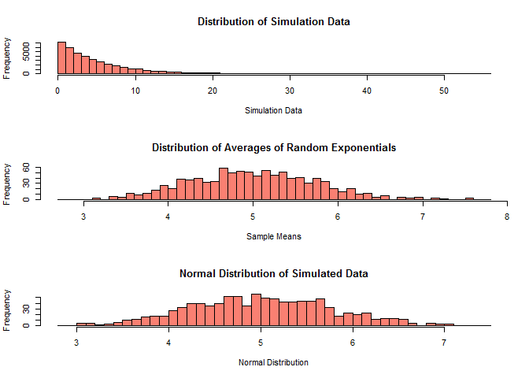

In this project we will investigate the exponential distribution in R and compare it with the Central Limit Theorem. The exponential distribution can be simulated in R with rexp(n, lambda) where lambda is the rate parameter. The mean of exponential distribution is 1/lambda and the standard deviation is also 1/lambda. Set lambda = 0.2 for all of the simulations. We will investigate the distribution of averages of 40 exponentials. Note that we will need to do a thousand simulations.

Illustrate via simulation and associated explanatory text the properties of the distribution of the mean of 40 exponentials.

* Show the sample mean and compare it to the theoretical mean of the distribution.
* Show how variable the sample is (via variance) and compare it to the theoretical variance of the distribution.
* Show that the distribution is approximately normal.


```r
library(ggplot2)
set.seed(123)
#Initialing given information
sim <- 1000
n <- 40
lambda <- 0.2
tMean <- 1/lambda
tSd <- 1/lambda
tVar <- tSd^2
#simulating the data
simData <- matrix(rexp(n*sim, lambda), nrow = sim, ncol = n)
```

##Distribution of 1000 Averages of 40 random Exponentials


```r
#Calculate Mean across the Matrix w.r.t. Rows
distMean <- apply(simData, 1, mean)
#Plot histogram of averages calculated
hist(distMean, breaks = 50, col = "cyan", 
     xlab = "Sample Mean", ylab = "Frequency", 
     main = "Distribution of 1000 Averages of 40 random Exponentials")
abline(v = tMean, lty = 1, lwd = 4, col = "red")
legend("topright", legend = "Theoretical Mean", 
       border = "black", lty = 1, lwd = 4, col = "red")
```

<!-- -->

From the graph we come to know that the Sample Mean obtained from the Simulated Data is very close to the Theoretical Mean of the Data. We can conclude that the Sample Means are normally distributed with its peak very close to the Theoretical Mean

##Distribution of 1000 Variances of 40 random Exponentials


```r
#Calculate Variance across the Matrix w.r.t. Rows
distVar <- apply(simData, 1, var)
#Plot histogram of variances calculated
hist(distVar, breaks = 50, col = "cyan", 
     xlab = "Sample Variance", ylab = "Frequency", 
     main = "Distribution of 1000 Variances of 40 random Exponentials")
abline(v = tVar, lty = 1, lwd = 4, col = "red")
legend("topright", legend = "Theoretical Variance", 
       border = "black", lty = 1, lwd = 4, col = "red")
```

<!-- -->

From the graph we come to know that the Sample Variance obtained from the Simulated Data is very close to the Theoretical Variance of the Data. We can conclude that the Sample Variance are normally distributed with its peak very close to the Theoretical Variance

##Distribution is approximately Normal


```r
#Simulating the Normal Distribution w.r.t. the Averages of the Exponentials
simNormData <- rnorm(1000, mean = mean(distMean), sd = sd(distMean))
par(mfrow = c(3,1))
#Plotting the Simulated Data
hist(simData, breaks = 50, col = "salmon", 
     xlab = "Simulation Data", ylab = "Frequency", 
     main = "Distribution of Simulation Data")
#Plotting the Average Distribution
hist(distMean, breaks = 50, col = "salmon", 
     xlab = "Sample Means", ylab = "Frequency", 
     main = "Distribution of Averages of Random Exponentials")
#Plotting the Normal Distribution of Averages
hist(simNormData, breaks = 50, col = "salmon", 
     xlab = "Normal Distribution", ylab = "Frequency", 
     main = "Normal Distribution of Simulated Data")
```

<!-- -->

The first histogram is the distribution of the exponentials with lambda equals to 0.2. The second histogram is the distribution of 1000 averages of 40 random exponentials. The third histogram is a real normal distribution with a mean and standard deviation equals to the second histogram’s.
* Comparing the first with the second histogram, we can see that the distrubution becames normal as the means were taken from each groups. It is a result of the central limit theorem.
* Comparing the second and the third histogram, we can see the distribution of the means is similar to a real normal distribution with the same mean and standard deviation.
