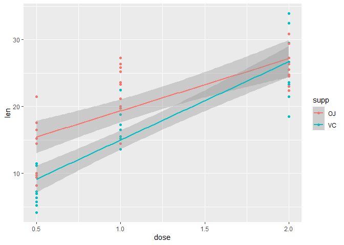
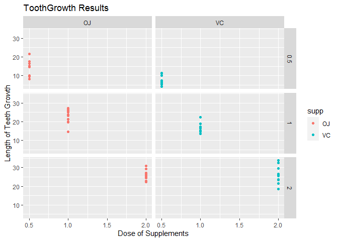

In this project we will perform analysis on the ToothGrowth data in the R datasets package and perform some hypothesis tests on the data in the context of finding the relations within the several attributes of the dataset.

* Load the ToothGrowth data and perform some basic exploratory data analyses
* Provide a basic summary of the data.
* Use confidence intervals and/or hypothesis tests to compare tooth growth by supp and dose. (Only use the techniques from class, even if there's other approaches worth considering)
* State your conclusions and the assumptions needed for your conclusions.


```r
#Loading essential Libraries
library(datasets)
library(ggplot2)
#Loading ToothGrowth data and looking at its contents
data(ToothGrowth)
head(ToothGrowth)
```

```
##    len supp dose
## 1  4.2   VC  0.5
## 2 11.5   VC  0.5
## 3  7.3   VC  0.5
## 4  5.8   VC  0.5
## 5  6.4   VC  0.5
## 6 10.0   VC  0.5
```

```r
str(ToothGrowth)
```

```
## 'data.frame':	60 obs. of  3 variables:
##  $ len : num  4.2 11.5 7.3 5.8 6.4 10 11.2 11.2 5.2 7 ...
##  $ supp: Factor w/ 2 levels "OJ","VC": 2 2 2 2 2 2 2 2 2 2 ...
##  $ dose: num  0.5 0.5 0.5 0.5 0.5 0.5 0.5 0.5 0.5 0.5 ...
```

Performing some Exploratory Data Analysis in order to get an idea about the contents of the Dataset like for example how data is distributed based on different supplements & amount of doses. 


```r
#Plotting a graph using ggplot function to visualize the relations 
#between various attributes in the Dataset
ggplot(data = ToothGrowth, aes(dose, len, color = supp)) + 
      geom_point() + 
      geom_smooth(method = "lm")
```

```
## `geom_smooth()` using formula 'y ~ x'
```

<!-- -->

Summarinzing the Dataset to find out additional information about the extent of various attributes of the data in the ToothGrouwth Dataset.

Categorizing based on levels of the Supplements and Amount of Doses attributes to analyze their results on the change in the Tooth Length based on the medication for several patients.


```r
summary(ToothGrowth)
```

```
##       len        supp         dose      
##  Min.   : 4.20   OJ:30   Min.   :0.500  
##  1st Qu.:13.07   VC:30   1st Qu.:0.500  
##  Median :19.25           Median :1.000  
##  Mean   :18.81           Mean   :1.167  
##  3rd Qu.:25.27           3rd Qu.:2.000  
##  Max.   :33.90           Max.   :2.000
```

```r
sd(ToothGrowth$len)
```

```
## [1] 7.649315
```

```r
ggplot(ToothGrowth, aes(dose, len, color = supp)) + 
      geom_point() + facet_grid(dose ~ supp) + 
      ggtitle("ToothGrowth Results") + 
      xlab("Dose of Supplements") + ylab("Length of Teeth Growth")
```

<!-- -->

Now, let us test our data to see the relation based on the type of supplements given to the patients.


```r
suppTest <-t.test(len ~ supp, data = ToothGrowth, paired = FALSE)
suppTest
```

```
## 
## 	Welch Two Sample t-test
## 
## data:  len by supp
## t = 1.9153, df = 55.309, p-value = 0.06063
## alternative hypothesis: true difference in means is not equal to 0
## 95 percent confidence interval:
##  -0.1710156  7.5710156
## sample estimates:
## mean in group OJ mean in group VC 
##         20.66333         16.96333
```

We perform the Welsh Two Sided Test for a 95% confidence interval it can be seen that it has the range of **-0.1710156, 7.5710156**


```r
subData1 <- ToothGrowth[ToothGrowth$dose %in% c(0.5,1),]
t.test(len ~ dose, data = subData1, paired = FALSE)
```

```
## 
## 	Welch Two Sample t-test
## 
## data:  len by dose
## t = -6.4766, df = 37.986, p-value = 1.268e-07
## alternative hypothesis: true difference in means is not equal to 0
## 95 percent confidence interval:
##  -11.983781  -6.276219
## sample estimates:
## mean in group 0.5   mean in group 1 
##            10.605            19.735
```

```r
subData2 <- ToothGrowth[ToothGrowth$dose %in% c(0.5,2),]
t.test(len ~ dose, data = subData2, paired = FALSE)
```

```
## 
## 	Welch Two Sample t-test
## 
## data:  len by dose
## t = -11.799, df = 36.883, p-value = 4.398e-14
## alternative hypothesis: true difference in means is not equal to 0
## 95 percent confidence interval:
##  -18.15617 -12.83383
## sample estimates:
## mean in group 0.5   mean in group 2 
##            10.605            26.100
```

```r
subData3 <- ToothGrowth[ToothGrowth$dose %in% c(1,2),]
t.test(len ~ dose, data = subData3, paired = FALSE)
```

```
## 
## 	Welch Two Sample t-test
## 
## data:  len by dose
## t = -4.9005, df = 37.101, p-value = 1.906e-05
## alternative hypothesis: true difference in means is not equal to 0
## 95 percent confidence interval:
##  -8.996481 -3.733519
## sample estimates:
## mean in group 1 mean in group 2 
##          19.735          26.100
```
